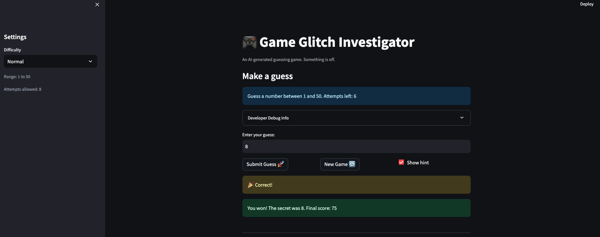

# 🎮 Game Glitch Investigator: The Impossible Guesser

## 🚨 The Situation

You asked an AI to build a simple "Number Guessing Game" using Streamlit.
It wrote the code, ran away, and now the game is unplayable. 

- You can't win.
- The hints lie to you.
- The secret number seems to have commitment issues.

## 🛠️ Setup

1. Install dependencies: `pip install -r requirements.txt`
2. Run the broken app: `python -m streamlit run app.py`

## 🕵️‍♂️ Your Mission

1. **Play the game.** Open the "Developer Debug Info" tab in the app to see the secret number. Try to win.
2. **Find the State Bug.** Why does the secret number change every time you click "Submit"? Ask ChatGPT: *"How do I keep a variable from resetting in Streamlit when I click a button?"*
3. **Fix the Logic.** The hints ("Higher/Lower") are wrong. Fix them.
4. **Refactor & Test.** - Move the logic into `logic_utils.py`.
   - Run `pytest` in your terminal.
   - Keep fixing until all tests pass!

## 📝 Document Your Experience

- [ ] Describe the game's purpose.

The purpose of the game is to have the user guess a secret number within a range based on difficulty, where the hints and attempts are limited. 

- [ ] Detail which bugs you found.

There were several bugs I found. One of them was that sometimes when the game said to go higher for a guess, the secret was a lower number. Another bug was that a new game wouldn't always start after a win or loss. There were also cases of out-of-range guesses not being rejected. There were instances where the heading was not updating depending on the difficulty mode of the problem. Also, the ranges for the difficulties were not aligned. For instance, hard and normal ranges were mixed. 

- [ ] Explain what fixes you applied.

I swapped the hint messages in check_guess() to ensure that the game would suggest a higher guess or lower guess if the guess was too high or too low. When a new game was started, I ensured that all of the session state variables were reset. Also, I made sure that guesses that were out-of-range were accpeted by incorporating range validation in parse_guess(). I also just reordered the ranges to make easy go from (1,20), Normal go to (1, 50), and Hard from (1, 100). Also, the attempts were off by one, so I set the initial attempts value from 1 to 0. There was some code that cast the secret to a string on even attempts, which I removed. Also, the game's range was hardcoded to (1, 100), so I changed it to random.randint(low, high).

## 📸 Demo

- [ ] [Insert a screenshot of your fixed, winning game here]

## 🚀 Stretch Features

- [ ] [If you choose to complete Challenge 4, insert a screenshot of your Enhanced Game UI here]
